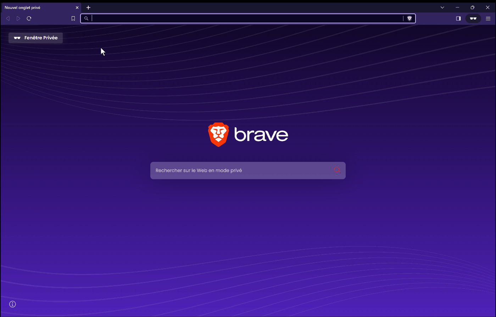

# Varnish Cache Management Project

This project demonstrates the use of Varnish Cache for optimizing server response times by efficiently caching and serving frequently accessed content. It showcases Varnish's ability to distinguish between server-originated responses and cached content, ultimately boosting performance and user experience.



## Prerequisites

Before getting started, make sure you have the following dependencies installed:

- [Docker](https://www.docker.com/)
- [Docker Compose](https://docs.docker.com/compose/install/)

## Getting Started

1. Clone this repository to your local machine:

   ```bash
   git clone https://github.com/J-hune/varnish-cache.git
   ```

2. Navigate to the project directory:

   ```bash
   cd varnish-cache
   ```

3. Create a `.env` file by making a copy of the provided `.env.example`:

   ```bash
   cp .env.example .env
   ```

4. Modify the `.env` file with your preferred settings:

    - `BACKEND_DOMAIN_NAME`: Set your domain name (e.g., jhune.space).
    - `BACKEND_PORT`: Set the port on which your Node.js application will run (e.g., 8080).
    - `VARNISH_TTL`: Set the cache time-to-live value (e.g., 3s).
    - `VARNISH_GRACE`: Set the cache grace period (e.g., 2s).
    - `ACME_EMAIL`: Provide your email for Let's Encrypt certificate registration (e.g., donovann@jhune.dev).
    - `TRAEFIK_LOG_LEVEL`: Set the log level (e.g., ERROR).

5. Start the project using Docker Compose:

   ```bash
   ./start.sh
   ```

6. The project will now be running, and Varnish Cache will handle content caching, and the Node.js application will display cached content.

## Accessing the Cached Content

You can access the cached content at the following URL:

- Cached Content: [https://BACKEND_DOMAIN_NAME/test](https://BACKEND_DOMAIN_NAME/test)

Replace `BACKEND_DOMAIN_NAME` with the domain name you specified in your `.env` file.

## Cache Behavior and Stale-While-Revalidate

Varnish Cache introduces the concept of **stale-while-revalidate** to optimize content delivery. Here's how it works:

- **Time-to-Live (TTL)**: The `VARNISH_TTL` environment variable defines the cache time-to-live value. It specifies how long cached content remains valid. After this period, Varnish considers the content as potentially stale.

- **Grace Period (Grace)**: The `VARNISH_GRACE` environment variable defines the cache grace period. During this period, Varnish will serve potentially stale content while revalidating it with the backend. This helps ensure seamless content delivery even when the cache is being updated.

## Time Display and Cache Behavior

The Node.js application now displays the current time in HH:mm:ss format, illustrating cache stale-while-revalidate behavior. The time is displayed using the EJS templating engine, making cache behavior visible to users.

## License

This project is licensed under the MIT License. See the [LICENSE](LICENSE) file for details.

Enjoy optimizing your web content with Varnish Cache!